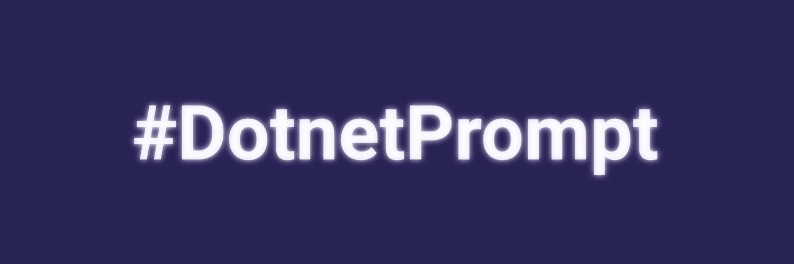



# Welcome to DotnetPrompt

Welcome to our library, which is designed to support the development of cutting-edge applications powered by Large Language Models (LLMs) in dotnet.

As you may know, LLMs are an exciting and rapidly-evolving technology that offers developers unprecedented natural language processing and generation capabilities. However, LLMs can achieve their full potential when used in conjunction with other sources of computation or knowledge.

Our library helps you integrate LLMs with other tools and resources to create powerful and sophisticated applications. Some examples of solutions that you could create using our library include:
- Summarization
- Question Answering
- Code Generation
- Chatbots
- and much more

## Getting Started

You could start with the below guide for a walkthrough of how to get started using DotnetPrompt to create an Language Model application.

- [Getting Started Documentation](./articles/getting_started.md)

## Basic Blocks

Several basic components are available in DotnetPrompt, and several more are coming soon.

We provide how-to guides to get started, examples, and reference docs for each component.

- [Prompts](./articles/prompts/getting_started.md): Prompts are how you communicate with LLMs. This component includes prompt management, optimization, and usage of few-shot prompts.

- [LLMs](./articles/llms/getting_started.md): LLM is a generic interface for Large Language Models provider. We have implementation for some widespread providers and standard utilities for working with them out of the box.

- [Chains](./articles/chains/getting_started.md): Chains are sequences of LLMs or a different utility combined in Dataflow to achieve some tasks. With DotnetPrompt, you get a standard interface for chains and several commonly used implementations.

- [Tools](./articles/tools/getting_started.md): Different valuable tools for building Nature Language applications, without need to get into python.

## Use Cases
    
DotnetPrompt provides examples of several common use cases, and this documentation offers guidance and assistance on how to use the components in different ways.

- [Summarization](./articles/usecases/summarization.md): Summarizing longer documents into shorter, more condensed chunks of information.

- [Question Answering](./articles/usecases/chatbots.md): This technique involves utilizing only the information in provided documents to construct an answer to a given question.

- [Docs Generation](./articles/usecases/docs_generation.md): Generating documentation to a source file. This is a common use case for many applications, and DotnetPrompt provides some prompts/chains for assisting in this.

- [Chatbots](./articles/usecases/chatbots.md): Since language models are good at producing text, that makes them ideal for creating chatbots.

- More use cases coming soon; subscribe to [@DotnetPrompt](https://twitter.com/dotnetprompt) to be updated

## Reference Docs

All of DotnetPrompt's reference documentation, in one place. Full documentation on all methods, classes

- [Reference Documentation](./api/index.md)

## Additional Resources 

- [List of related research papers](./articles/research_papers.md): there are a lot of work going to invent better ways to work with LLMs. Some ideas of this framework is based on papers we listed there.

> [!NOTE]
> This project initially was started as a port of popular Python framework [LangChain](https://github.com/hwchase17/langchain). 
> We're so grateful to the LangChain team for creating such an awesome Python framework, which inspired us to create the port that allows the dotnet community to use LLMs with ease. 